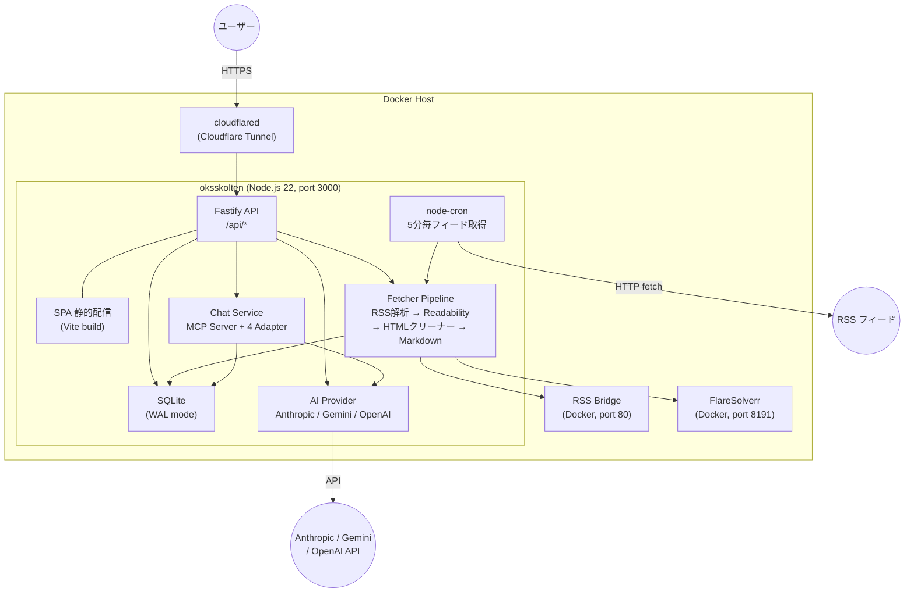

# Oksskolten 実装仕様書 — アーキテクチャ

> [概要に戻る](./01_overview.ja.md)

## システム全体像



## データフロー

### 記事取り込み（Cron: 5分毎）

```
1. feeds テーブルから有効な RSS フィードを取得 (disabled=0, type='rss')
2. RSS/Atom/RDF を fetch・パース (feedsmith → fast-xml-parser フォールバック)
   └─ Bot認証が必要なサイト → FlareSolverr 経由
   └─ rss_bridge_url がある場合 → RSS Bridge 経由
3. 新着記事ごとに (セマフォ: 同時5件):
   a. HTML取得 → Worker Thread で DOM解析 (pre-clean → Readability → post-clean → Markdown変換)
   b. OGP画像・excerpt抽出
   c. 言語判定 (CJK文字比率、ローカル処理)
   d. SQLite に INSERT (失敗時は last_error 記録、次回リトライ)
4. 連続5回失敗 → フィード自動無効化 (disabled=1)
```

### 記事閲覧（オンデマンド）

```
1. ユーザーが記事を開く → GET /api/articles/by-url
2. 「要約」タブ → POST /api/articles/:id/summarize (SSE ストリーミング)
   └─ LLM で日本語要約生成 → summary カラムにキャッシュ
3. 「日本語」タブ → POST /api/articles/:id/translate (SSE ストリーミング)
   └─ LLM or Google Translate → full_text_ja カラムにキャッシュ
4. 2回目以降はキャッシュから即時返却 (API呼び出しなし)
```

### 認証

```
3方式ハイブリッド (最低1つは常に有効):
├─ パスワード: bcryptjs + JWT (30日有効)
├─ Passkey: WebAuthn (@simplewebauthn) + JWT
└─ GitHub OAuth: arctic + ワンタイム交換コード → JWT
```

## なぜこの構成なのか

Oksskolten は「`docker compose up` だけで動く」ことを最優先に設計しています。外部データベース不要、外部キューサービス不要、外部 cron サービス不要。すべてが1つのコンテナに収まります。

### SQLite を選んだ理由

PostgreSQL や MySQL ではなく SQLite を採用しています。

- **外部依存ゼロ**: データベースサーバーの起動・管理が不要。ファイル1つがデータベースそのもの
- **バックアップが簡単**: `data/rss.db` をコピーするだけ。`pg_dump` のようなツールは不要
- **パフォーマンス十分**: 個人〜少人数の RSS リーダーでは SQLite の WAL モードで読み書き性能に問題は生じない
- **移行が楽**: SQLite ファイルをそのまま別マシンに持っていける

### 単一コンテナにした理由

API サーバー、SPA 配信、cron ジョブを1つのプロセスに同居させています。

- **docker compose が1サービスで済む**: `web` + `db` + `worker` のようなマルチコンテナ構成は個人ツールには過剰
- **プロセス間通信が不要**: cron ジョブが直接 DB に書き込む。メッセージキューやワーカープロセスを挟まない
- **リソース消費が小さい**: NAS・VPS・Raspberry Pi のような低スペック環境でも動く
- **Worker Thread でイベントループを保護**: cron の記事取得で使う jsdom + Readability は CPU 集約的な同期処理だが、piscina の Worker Thread プール（max 2 スレッド）で実行するため、API のイベントループはブロックされない

### React SPA を選んだ理由

Next.js や Remix ではなく、React の SPA (Vite ビルド) を採用しています。

- **サーバー依存が薄い**: ビルド済み静的ファイルを配信するだけ。フロントエンドのランタイムがサーバーに必要ない
- **フォークしやすい**: フロントを差し替えたい人が API だけ使って自作 UI を載せられる
- **SSR 不要**: ログイン必須の個人ツールなので SEO が不要。SPA で十分

### 選ばなかった構成

| 構成 | 選ばなかった理由 |
|---|---|
| Vercel + サーバーレス | SQLite が使えない。DB の外部サービス依存が増え、セルフホストの手軽さが失われる |
| エッジ環境 (Cloudflare Workers 等) | 常駐プロセスが持てず cron が動かない。API の実行時間制限が要約・翻訳処理と合わない |
| Next.js / Remix | SSR が不要な個人ツールに対して過剰。Vercel 前提の設計思想がセルフホストと相性が悪い |
| htmx | UI の複雑度 (コンテキストメニュー、無限スクロール、ストリーミング表示) が htmx の得意領域を超えている |
| マイクロサービス / キュー | 個人用 RSS リーダーに分散システムは過剰。単一プロセスの方が運用・デバッグとも簡単 |
